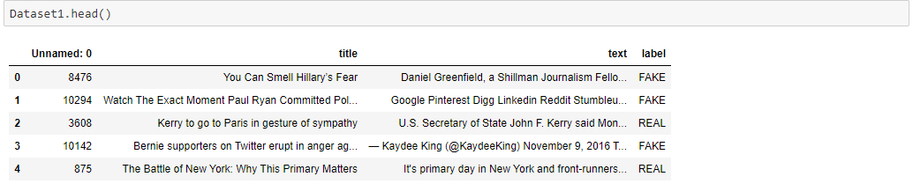
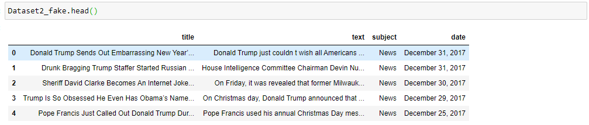
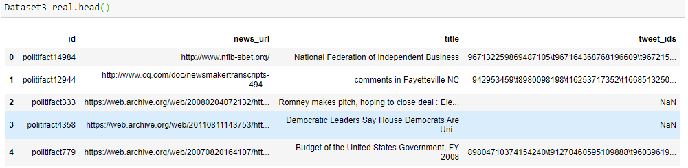
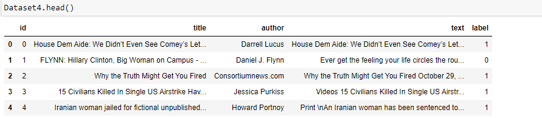
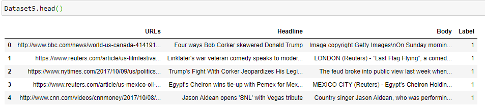
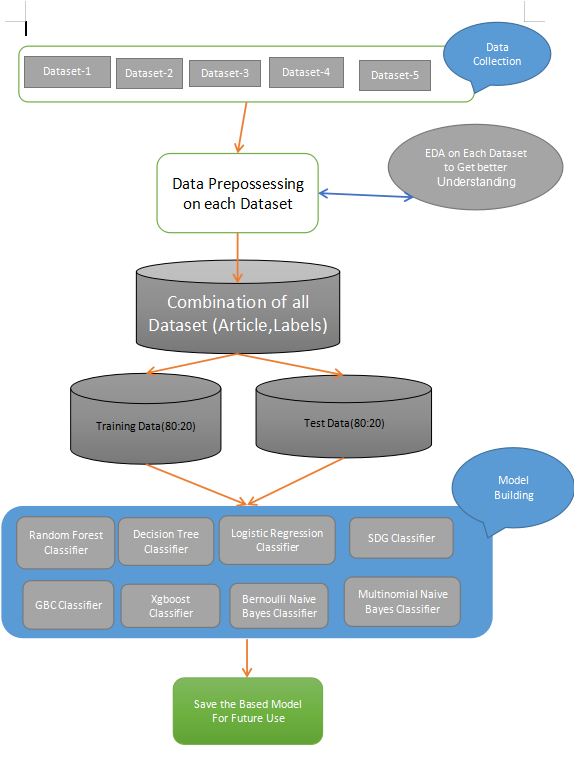
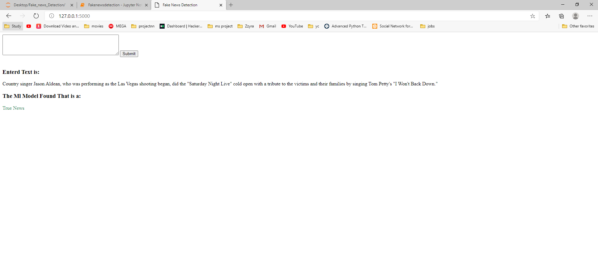
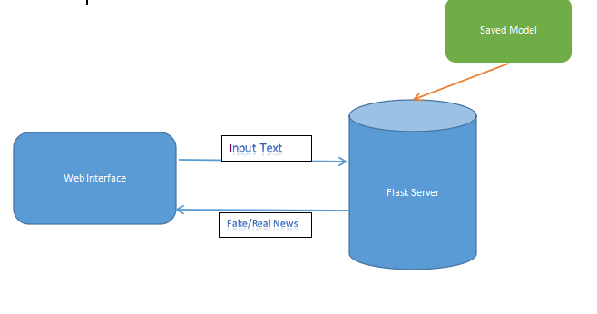

# Fake News Detection
## **Overview**
The proliferation of digital media has fundamentally transformed how information is consumed. While online news portals and social networking platforms offer near-instantaneous updates, they have also become conduits for the rapid spread of "fake news." These distorted or entirely fabricated narratives are often engineered to manipulate public opinion, serve specific agendas, or generate sensationalist engagement.

The spread of deliberate disinformation poses a significant threat to social cohesion and informed decision-making. This project addresses this challenge by leveraging Natural Language Processing (NLP) and Machine Learning to evaluate the veracity of news articles based on their textual content. By developing a robust predictive model and deploying it via a Flask web interface, this system provides an accessible tool for identifying misinformation in real time.

## Prerequisites

### System Requirements
* **Python 3.9+**: Ensure Python is installed on your system. You can download the latest version from [python.org](https://www.python.org/downloads/).
* **Environment Variables**: Ensure Python is added to your system's `PATH`. If you encounter a "command not recognized" error, refer to [this guide](https://www.pythoncentral.io/add-python-to-path-python-is-not-recognized-as-an-internal-or-external-command/).

### Required Libraries
The project utilizes the following stack:
* **Scikit-learn**: For implementing machine learning algorithms.
* **Pandas & NumPy**: For data manipulation and numerical analysis.
* **Matplotlib & Seaborn**: For data visualization.
* **NLTK**: For Natural Language Processing tasks (tokenization, stop-word removal, etc.).
* **Joblib**: For model serialization.
* **Flask**: For the web application framework.
3. To install the Packages
```Language
pip install -r requirments.txt
```
4. Or else use can download anaconda and use its anaconda prompt to run the commands. To install anaconda check this url https://www.anaconda.com/download/. most the Packages are preinstalled in the anaconda environment

## **Dataset**
All of the Dataset that used in this project are availabe in public Domain.Most of the Dataset are collected from Kaggle (https://www.kaggle.com/)
different datsets contain  different column and different information like [title,text,subject,news_url,author]
* _sample view of Dataset1_
* _sample view of Dataset2_
* _sample view of Dataset3_
* _sample view of Dataset4_
* _sample view of Dataset5_

For model Build need only text and Label,The final dataset will contain only 2 column ['Article','Label']
  * For text we will create a news column named 'Article' which is the Combination Header and text
  * In the Label column 
      * 1 replaset true
      * 0 replasent fake

## Data Preparation & Preprocessing

The model is built using two primary columns:
* **Article**: A combined feature consisting of the article header and body text.
* **Label**: The target variable where **1** represents **True** and **0** represents **Fake**.

### Data Cleaning Steps:
1.  **Feature Selection**: Removal of irrelevant metadata columns.
2.  **Handling Missing Data**: Removal of records with null values.
3.  **Text Normalization**: Removing brackets, punctuation (commas, apostrophes, quotes, etc.), and special characters.
4.  **Noise Removal**: Elimination of numerical text and URLs to focus purely on linguistic patterns.

---

## Model Training & Evaluation

We evaluated several machine learning classifiers to determine the most effective approach for fake news detection:

* **Linear Models**: Logistic Regression, Stochastic Gradient Descent (SGD).
* **Ensemble Methods**: Random Forest, Gradient Boosting (GBC), XGBoost.
* **Naive Bayes**: Multinomial and Bernoulli Naive Bayes.
* **Tree-based**: Decision Tree.

### Performance Analysis
Each model was trained on a dataset of **61,000+ records**. While multiple classifiers were tested, **Logistic Regression** emerged as the top performer with an accuracy of **87.04%**.

.png)

The finalized model is serialized as `model.pkl` for production use.

#### Model Building Pipeline:


---

## Deployment

The system is deployed using a **Flask** web framework. The interface allows users to input news text, which is then processed and analyzed by the backend model to return a "True" or "Fake" classification.

### User Interface Examples:
| Example 1 (Prediction) | Example 2 (Prediction) |
| :--- | :--- |
|  |  |

#### Deployment Architecture:


---

## Execution Guide

### 1. Clone the Repository
```bash
git clone https://github.com/Gargee1989/Fake-news-detection.git
cd Fake-news-detection
```
### 2. Environment Setup (Recommended)
To avoid library conflicts, it is recommended to create a virtual environment:
```bash
# Create the environment
python -m venv venv

# Activate it (Windows)
.\venv\Scripts\activate

# Activate it (macOS/Linux)
source venv/bin/activate
``` 
3. Install Dependencies
Install all required libraries using the requirements.txt file:

```bash
pip install -r requirements.txt
```
4. Run the Application
Navigate to the deployment directory and start the Flask server:

```bash
# Navigate to the flask app directory
cd "Model deployment using Flask"

# Launch the application
python app.py
```
5. Access the Web Interface
* **Once the terminal displays Running on http://127.0.0.1:5000, open your web browser.**
* **Navigate to: http://localhost:5000/**
* **Input the news article text into the provided text area and click Submit.**
* **The system will process the text and display whether the news is "True" or "Fake".**
---
### Future Enhancements
While the current accuracy of 87.04% is robust given the large dataset, we aim to improve performance through:

1. **Advanced NLP**: Implmenting Stopword removal, Lemmatization, and WordNet integration.
2. **Hyperparameter Tuning**: Optimizing classifier parameters beyond default settings.
3. **Deep Learning**: Exploring LSTM or BERT-based architectures for more nuanced textual understanding.
